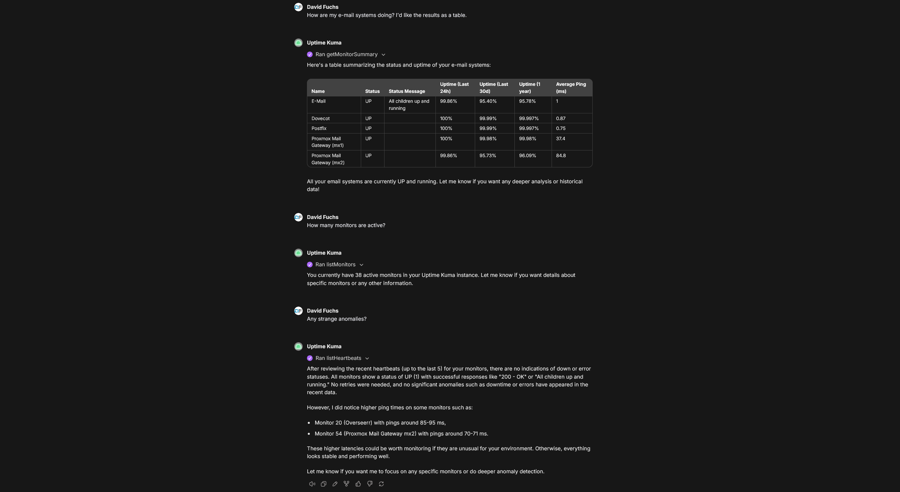

# mcp-uptime-kuma

A [Model Context Protocol (MCP)](https://modelcontextprotocol.io/) server for [Uptime Kuma](https://github.com/louislam/uptime-kuma) *version 2*. Supports stdio and streamable HTTP transports.


## Features

- **Uptime Kuma Integration**: Real-time access to monitors, heartbeats, uptime, and responsiveness metrics from Uptime Kuma via a Socket.IO connection. This MCP server is immediately notified of status changes in Uptime Kuma and caches this information for fast retrieval.
- **Context-Friendly**: Carefully controls the amount of data returned to avoid overwhelming the LLM context window. Tools default to returning only essential fields and recent heartbeats, with options to request more when needed.
- **Multiple Transports**: Supports both stdio (for local integration) and streamable HTTP (for remote access).

## Available Tools

| Tool | Purpose |
|------|---------|
| `getMonitorSummary` | Get a quick overview of all monitors with their current status. Supports filtering by keywords, type, active/maintenance status, tags, and current status. |
| `listMonitors` | Get the full list of all monitors with configurations. Supports filtering by keywords, type, active/maintenance status, and tags. |
| `getMonitor` | Get detailed configuration for a specific monitor by ID |
| `pauseMonitor` | Pause a monitor to stop performing checks |
| `resumeMonitor` | Resume a paused monitor to restart checks |
| `listHeartbeats` | Get status check history for all monitors |
| `getHeartbeats` | Get status check history for a specific monitor |
| `getSettings` | Get Uptime Kuma server settings |

### Filtering

Both `getMonitorSummary` and `listMonitors` support powerful filtering options:

- **Keywords**: Space-separated keywords for fuzzy matching against monitor pathNames
- **Type**: Filter by monitor type(s). Comma-separated for multiple types - e.g., `"http"` or `"http,ping,dns"`
- **Active Status**: Filter by active (`true`) or inactive (`false`) monitors
- **Maintenance Status**: Filter by maintenance mode status
- **Tags**: Filter by tag name and optional value. Comma-separated for multiple tags - format: `"tagName"` or `"tagName=value"`. Monitors must have all specified tags.
- **Status** (getMonitorSummary only): Filter by current heartbeat status. Comma-separated for multiple - `"0"`=DOWN, `"1"`=UP, `"2"`=PENDING, `"3"`=MAINTENANCE

**Examples:**
- Get all DOWN monitors: `getMonitorSummary({ status: "0" })`
- Get all HTTP monitors in maintenance: `getMonitorSummary({ type: "http", maintenance: true })`
- Get all inactive monitors with tag "production": `listMonitors({ active: false, tags: "production" })`
- Get monitors with environment tag set to "staging": `getMonitorSummary({ tags: "env=staging" })`
- Get monitors with multiple tags: `listMonitors({ tags: "production,region=us-east" })`
- Get DOWN or PENDING monitors: `getMonitorSummary({ status: "0,2" })`
- Get HTTP or ping monitors: `getMonitorSummary({ type: "http,ping" })`
- Get monitors matching "web" or "api": `getMonitorSummary({ keywords: "web api" })`

## Example Conversation


*Conversation in [LibreChat](https://github.com/danny-avila/LibreChat) where the `mcp-uptime-kuma` server is providing real-time information from Uptime Kuma.*

## Quick Start

### Using npx (stdio transport)

Most folks will want to configure mcp-uptime-kuma using stdio as follows.

```json
{
  "mcpServers": {
    "uptime-kuma": {
      "command": "npx",
      "args": ["-y", "@davidfuchs/mcp-uptime-kuma"],
      "env": {
        "UPTIME_KUMA_URL": "http://your-uptime-kuma-instance:3001",
        "UPTIME_KUMA_USERNAME": "your_username",
        "UPTIME_KUMA_PASSWORD": "your_password",
      }
    }
  }
}
```

If authentication is disabled on your Uptime Kuma instance, you can remove the username/password environment variables. See the [Usage Instructions](#usage-instructions) section for more details on authentication methods.

### Using Docker (streamable HTTP transport)

For remote access or containerized deployments, you can run mcp-uptime-kuma as a Docker container using the streamable HTTP transport.

**Option 1: Using Docker Compose**

Create a `docker-compose.yml` file:

```yaml
services:
  mcp-uptime-kuma:
    image: davidfuchs/mcp-uptime-kuma:latest
    container_name: mcp-uptime-kuma
    environment:
      - UPTIME_KUMA_URL=http://your-uptime-kuma-instance:3001
      - UPTIME_KUMA_USERNAME=your_username  # Optional
      - UPTIME_KUMA_PASSWORD=your_password  # Optional
      # OR use JWT token authentication:
      # - UPTIME_KUMA_JWT_TOKEN=your_jwt_token
      - PORT=3000  # Optional, defaults to 3000
    ports:
      - "3000:3000"
    command: ["-t", "streamable-http"]
    restart: unless-stopped
```

Then run:

```bash
docker compose up -d
```

**Option 2: Using Docker Run**

```bash
docker run -d \
  --name mcp-uptime-kuma \
  -p 3000:3000 \
  -e UPTIME_KUMA_URL=http://your-uptime-kuma-instance:3001 \
  -e UPTIME_KUMA_USERNAME=your_username \
  -e UPTIME_KUMA_PASSWORD=your_password \
  davidfuchs/mcp-uptime-kuma:latest \
  -t streamable-http
```

The MCP endpoint will be available at `http://mcp-uptime-kuma:3000/mcp` on your Docker host.

**Configuring Your MCP Client**

After starting the Docker container, configure your MCP client to connect to it:

```json
{
  "mcpServers": {
    "uptime-kuma": {
      "url": "http://mcp-uptime-kuma:3000/mcp"
    }
  }
}
```

Or for LibreChat (librechat.yaml):

```yaml
mcpServers:
  uptime-kuma:
    url: "http://mcp-uptime-kuma:3000/mcp"
    serverInstructions: true
```

## Usage Instructions

### Prerequisites

- Node.js (v18 or higher)
- An Uptime Kuma instance (version 2)

### Authentication Methods

This MCP server supports three authentication methods for connecting to your Uptime Kuma instance.

> **A note about 2FA:** If you're using 2FA, it's recommended that you go straight for the JWT authentication approach and avoid username/password authentication, as your 2FA token will need to be refreshed every time you initialize the MCP server.
>
> Even with the JWT method, you may run into issues with token expiry, but as of this writing the JWT returned by Uptime Kuma does not appear to expire.

#### 1. Anonymous Authentication
If your Uptime Kuma instance has authentication disabled, you can connect without providing any credentials. Only the `UPTIME_KUMA_URL` environment variable is required.

- **Required Variables:**
  - `UPTIME_KUMA_URL`: The URL of your Uptime Kuma instance

#### 2. Username/Password Authentication
Standard authentication using your Uptime Kuma credentials. This method uses the `UPTIME_KUMA_USERNAME` and `UPTIME_KUMA_PASSWORD` environment variables.

- **Required Variables:**
  - `UPTIME_KUMA_URL`: The URL of your Uptime Kuma instance
  - `UPTIME_KUMA_USERNAME`: Your Uptime Kuma username
  - `UPTIME_KUMA_PASSWORD`: Your Uptime Kuma password
  
- **Optional Variable:**
  - `UPTIME_KUMA_2FA_TOKEN`: Your 2FA token (only required if two-factor authentication is enabled on your account)

#### 3. JWT Token Authentication
Token-based authentication using a JWT token from Uptime Kuma. This method uses the `UPTIME_KUMA_JWT_TOKEN` environment variable and takes precedence over username/password if both are provided.

- **Required Variables:**
  - `UPTIME_KUMA_URL`: The URL of your Uptime Kuma instance
  - `UPTIME_KUMA_JWT_TOKEN`: Your JWT token (see instructions below for how to obtain it)

##### How to Find Your JWT Token:

1. Log into your Uptime Kuma instance in your web browser
2. Open your browser's Developer Tools (F12 or right-click → Inspect)
3. Navigate to the **Storage** tab (Firefox) or **Application** tab (Chrome/Edge)
4. Under **Local Storage** or **Session Storage**, find your Uptime Kuma domain
5. Look for a key named `token` - the value is your JWT token (it should start with 'ey...')
6. Copy the token value and use it as `UPTIME_KUMA_JWT_TOKEN`

### Setting up mcp-uptime-kuma using the stdio transport

For many MCP clients, you can configure the server as follows:

**Option 1: Username/Password Authentication**
```json
{
  "mcpServers": {
    "uptime-kuma": {
      "command": "npx",
      "args": ["-y", "@davidfuchs/mcp-uptime-kuma"],
      "env": {
        "UPTIME_KUMA_URL": "http://your-uptime-kuma-instance:3001",
        "UPTIME_KUMA_USERNAME": "your_username",
        "UPTIME_KUMA_PASSWORD": "your_password",
      }
    }
  }
}
```

**Option 2: JWT Token Authentication**
```json
{
  "mcpServers": {
    "uptime-kuma": {
      "command": "npx",
      "args": ["-y", "@davidfuchs/mcp-uptime-kuma"],
      "env": {
        "UPTIME_KUMA_URL": "http://your-uptime-kuma-instance:3001",
        "UPTIME_KUMA_JWT_TOKEN": "your_jwt_token"
      }
    }
  }
}
```

See the [How to Find Your JWT Token](#how-to-find-your-jwt-token) section for instructions on how to obtain it.

If you're using LibreChat (librechat.yaml), you can configure it like this:

**Option 1: Username/Password Authentication (LibreChat):**
```yaml
mcpServers:
  uptime-kuma:                                                       
    command: npx                                                     
    args: ["-y", "@davidfuchs/mcp-uptime-kuma"]                      
    customUserVars:                                                  
      UPTIME_KUMA_URL:                                               
        title: "Uptime Kuma URL"
        description: "The URL to log into Uptime Kuma."
      UPTIME_KUMA_USERNAME:
        title: "Uptime Kuma Username"
        description: "The username to log into Uptime Kuma."
      UPTIME_KUMA_PASSWORD:
        title: "Uptime Kuma Password"
        description: "The password to log into Uptime Kuma."
    env:
      UPTIME_KUMA_URL: "{{UPTIME_KUMA_URL}}"
      UPTIME_KUMA_USERNAME: "{{UPTIME_KUMA_USERNAME}}"
      UPTIME_KUMA_PASSWORD: "{{UPTIME_KUMA_PASSWORD}}"
    serverInstructions: true
    startup: false
```

**Option 2: JWT Token Authentication (LibreChat)**
```yaml
mcpServers:
  uptime-kuma:
    command: npx
    args: ["-y", "@davidfuchs/mcp-uptime-kuma"]
    customUserVars:
      UPTIME_KUMA_URL:
        title: "Uptime Kuma URL"
        description: "The URL to log into Uptime Kuma."
      UPTIME_KUMA_JWT_TOKEN:
        title: "Uptime Kuma JWT Token"
        description: "JWT token for Uptime Kuma authentication."
    env:                                                             
      UPTIME_KUMA_URL: "{{UPTIME_KUMA_URL}}"
      UPTIME_KUMA_JWT_TOKEN: "{{UPTIME_KUMA_JWT_TOKEN}}"
    serverInstructions: true
    startup: false
```

See the [How to Find Your JWT Token](#how-to-find-your-jwt-token) section for instructions on how to obtain it.

If you're the only one using the LibreChat server, you can remove `customUserVars` and set the environment variables directly in the `env` section. You can also remove `startup: false` - that's only in there because without it, LibreChat tries to start the mcp-uptime-kuma MCP server immediately on startup, which fails because the user-provided credentials aren't available yet.

### Setting up mcp-uptime-kuma using the streamable HTTP transport

The recommended way to run the MCP server using streamable HTTP is to run it as a Docker container.

A [docker-compose.yml](docker-compose.yml) file is provided in the Github repository. Download it and update the included environment variables as needed for your Uptime Kuma deployment, and run:

`docker compose up -d`

The MCP endpoint will be available on your Docker host at port 3000 (configurable via `PORT` environment variable). If you'd prefer to run it directly on your host machine, see the Development Usage section below.

## Detailed Tool Descriptions

### getMonitorSummary
Retrieves a summarized list of all monitors with essential information and their current status.

- **Input**:
  - `keywords` (string, optional): Space-separated keywords to filter monitors by pathName (case-insensitive fuzzy match). All keywords must match for a monitor to be included.
  - `type` (string, optional): Filter by monitor type(s). Comma-separated for multiple types. Examples: `"http"`, `"http,ping,dns"`, `"port,docker"`
  - `active` (boolean, optional): Filter by active status. `true`=only active monitors, `false`=only inactive monitors
  - `maintenance` (boolean, optional): Filter by maintenance status. `true`=only monitors in maintenance, `false`=only monitors not in maintenance
  - `tags` (string, optional): Filter by tag name and optional value. Comma-separated for multiple tags. Format: `"tagName"` or `"tagName=value"`. Monitor must have all specified tags. Case-insensitive. Examples: `"production"`, `"env=staging"`, `"production,region=us-east"`
  - `status` (string, optional): Filter by current heartbeat status. Comma-separated for multiple statuses. `"0"`=DOWN, `"1"`=UP, `"2"`=PENDING, `"3"`=MAINTENANCE. Examples: `"0"`, `"0,2"`
- **Output**: Array of monitor summaries with:
  - Monitor ID, name, pathName
  - Monitor type
  - Active and maintenance state
  - Most recent heartbeat status (0=DOWN, 1=UP, 2=PENDING, 3=MAINTENANCE)
  - Status message from the most recent heartbeat
  - Associated tags
  - Uptime percentages for different periods (24h, 720h, 1y)
  - Average ping in milliseconds
  - Total count of matching monitors

### getMonitor
Retrieves detailed information about a specific monitor by its ID.

- **Input**: 
  - `monitorID` (number): The ID of the monitor to retrieve
  - `includeAdditionalFields` (boolean, optional): Include all additional fields from Uptime Kuma (default: false)
- **Output**: Monitor configuration object with details like URL, type, check interval, notification settings, etc.

### listMonitors
Retrieves the full list of all monitors the user has access to with their configuration details.

- **Input**:
  - `includeAdditionalFields` (boolean, optional): Include all additional fields from Uptime Kuma (default: false)
  - `keywords` (string, optional): Space-separated keywords to filter monitors by pathName (case-insensitive fuzzy match). All keywords must match for a monitor to be included.
  - `type` (string, optional): Filter by monitor type(s). Comma-separated for multiple types. Examples: `"http"`, `"http,ping,dns"`, `"port,docker"`
  - `active` (boolean, optional): Filter by active status. `true`=only active monitors, `false`=only inactive monitors
  - `maintenance` (boolean, optional): Filter by maintenance status. `true`=only monitors in maintenance, `false`=only monitors not in maintenance
  - `tags` (string, optional): Filter by tag name and optional value. Comma-separated for multiple tags. Format: `"tagName"` or `"tagName=value"`. Monitor must have all specified tags. Case-insensitive. Examples: `"production"`, `"env=staging"`, `"production,region=us-east"`
- **Output**: Array of monitor configuration objects with:
  - All monitor settings (URL, check interval, retry settings, notification configuration, etc.)
  - Tags and pathName
  - Uptime percentages and average ping
  - Total count of matching monitors

### getHeartbeats
Retrieves heartbeats (status checks) for a specific monitor.

- **Input**:
  - `monitorID` (number): The ID of the monitor to get heartbeats for
  - `maxHeartbeats` (number, optional): Maximum number of most recent heartbeats to return (1-100). Default: 1
- **Output**: Object containing:
  - `monitorID`: The monitor ID
  - `heartbeats`: Array of heartbeat objects with status, response time, timestamps, etc.
  - `count`: Number of heartbeats returned

### listHeartbeats
Retrieves the heartbeats for all monitors.

- **Input**:
  - `maxHeartbeats` (number, optional): Maximum number of most recent heartbeats per monitor (1-100). Default: 1
- **Output**: Object containing:
  - `heartbeats`: Map of monitor IDs to their heartbeat arrays
  - `monitorCount`: Number of monitors
  - `totalHeartbeatCount`: Total number of heartbeats across all monitors

### getSettings
Retrieves the current Uptime Kuma server settings.

- **Input**: None
- **Output**: Settings object containing:
  - `serverTimezone`: Server timezone setting
  - `checkUpdate`: Whether to check for updates
  - `searchEngineIndex`: Search engine indexing setting
  - `entryPage`: Entry page configuration
  - `dnsCache`: DNS cache setting
  - `keepDataPeriodDays`: Data retention period in days
  - `tlsExpiryNotifyDays`: TLS expiry notification days
  - `trustProxy`: Trust proxy setting
  - `nscd`: NSCD setting
  - `disableAuth`: Authentication disabled status
  - `primaryBaseURL`: Primary base URL (optional)

### pauseMonitor
Pauses a monitor, stopping it from performing checks. The monitor will remain in the system but will not send notifications or collect data until resumed.

- **Input**:
  - `monitorID` (number): The ID of the monitor to pause
- **Output**: Object containing:
  - `ok`: Boolean indicating success
  - `msg`: Optional status message

### resumeMonitor
Resumes a paused monitor, restarting its checks and notifications.

- **Input**:
  - `monitorID` (number): The ID of the monitor to resume
- **Output**: Object containing:
  - `ok`: Boolean indicating success
  - `msg`: Optional status message

## Developing

To run locally, clone the repository and follow these steps:

### Install dependencies

```bash
npm install
```

### Create the environment configuration

Copy [.env.example](.env.example) to `.env` and configure the required environment variables for your Uptime Kuma instance (URL and authentication method).

## Building

Build the TypeScript code to JavaScript:

```bash
npm run build
```

For development with auto-rebuild:

```bash
npm run watch
```

## Running

### Default (stdio Transport)

Run in production mode (requires build first):

```bash
npm start
```

or

```bash
npm run start:stdio
```

This mode is designed to be spawned by MCP clients (like Claude Desktop, VS Code, etc.) that communicate via standard input/output.

### Streamable HTTP Transport (for remote access)

Run in production mode (requires build first):

```bash
npm run start:http
```

By default, the HTTP server runs on port 3000. You can change this with the `PORT` environment variable:

```bash
PORT=8080 npm run start:http
```

The MCP endpoint will be available at `http://localhost:3000/mcp`

## Testing

You can test the server using the MCP Inspector:

```bash
npm run inspector
```

### For HTTP transport:
Start the HTTP server:
```bash
npm run dev:http
```

Then use the MCP Inspector:
```bash
npx @modelcontextprotocol/inspector
```
Connect to: `http://localhost:3000/mcp`

## Project Structure

```
mcp-uptime-kuma/
├── src/
│   ├── index.ts                # Main entry point with transport selection
│   ├── server.ts               # Core MCP server configuration with tools
│   ├── uptime-kuma-client.ts   # WebSocket client for Uptime Kuma API
│   ├── types.ts                # TypeScript type definitions
│   └── version.ts              # Runtime version information
├── .github/                    # GitHub workflows and configurations
├── .vscode/                    # VS Code workspace settings
├── docker-compose.yml          # Docker Compose configuration
├── Dockerfile                  # Docker image definition
├── .dockerignore               # Docker ignore file
├── .env.example                # Example environment configuration
├── .gitignore                  # Git ignore file
├── package.json                # Project dependencies and scripts
├── package-lock.json           # Locked dependency versions
├── tsconfig.json               # TypeScript configuration
├── LICENSE                     # License file
└── README.md                   # This file
```

## Development

To add new tools or modify existing ones, edit `src/server.ts`. The Uptime Kuma client in `src/uptime-kuma-client.ts` handles the WebSocket connection and retrieves monitor and heartbeat data.

## Learn More

- [Uptime Kuma](https://github.com/louislam/uptime-kuma)
- [Model Context Protocol Documentation](https://modelcontextprotocol.io/)
- [MCP TypeScript SDK](https://www.npmjs.com/package/@modelcontextprotocol/sdk)
- [MCP Specification](https://spec.modelcontextprotocol.io/)
